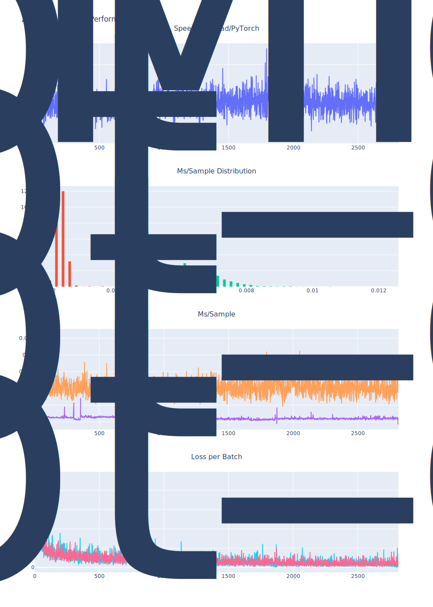

<p align="center">
  
</p>

<p align="center">
	
	
	
	
	<!--  -->
	<!-- 1325584101809324113 -->
	
</p>
<br>
<p align="center" class="markdown-heading"><strong><i>Supporting AI innovation from ideation to results.</i></strong></p>

---

> 🚧 **Zigrad is under active development.**  
> By using Zigrad, you are participating in its development and contributing to its early testing and validation. Expect APIs to change and features to evolve rapidly. Bug reports, benchmarks, and contributions are welcome.

> 🧪 **CUDA support is experimental.**  
> CUDA integration is in **beta** and may be incomplete, unstable, or suboptimal. Use it for testing and feedback. Full GPU support is actively being developed.
---

AI frameworks optimized for rapid research iteration do not seamlessly transition into the infrastructure required for large-scale training. This fragmented pipeline creates redundant engineering effort and slows iteration cycles. Zigrad provides a path to performance that preserves the natural development workflow researchers prefer; bridging research and engineering. Using Zigrad you can:

  - Experiment using high-level, PyTorch-like abstractions
  - Gradually opt into fine-grained control and performance optimizations
  - Access low-level primitives and assert control--without switching frameworks, code translation, or building complex extensions.
  - Quickly transition research to high performance training
  - Learn on the edge with SWAP constrained hardware


https://github.com/user-attachments/assets/3842aa72-9b16-4c25-8789-eac7159e3768

**Fast**
<!-- benchmarks -->

2.5x+ speedup over a compiled PyTorch model on Apple Silicon, 1.5x on x86. Expect similar performance gains across more architectures and platforms as MKL/CUDA support improves and Zigrad's ML graph compiler is operational.
<!-- link to a benchmarking page -->
<!-- only need one of the bm plots, probably fast vs fast since that requires the least explanation -->

<picture>
  <source media="(prefers-color-scheme: light)" srcset="docs/zg_mnist_zg_torch_perf.svg">
  <source media="(prefers-color-scheme: dark)" srcset="docs/zg_mnist_zg_torch_perf_dark.svg" >
  
</picture>
<!--  -->

<sub>*Tensorflow excluded for scaling purposes (too slow).</sub>

**Flexible**
Zigrad supports research workflows with high level abstractions for rapid prototyping, and integrations like Tensorboard and Mujoco. Zigrad supports the transition of research code to training infrastructure. 

Zigrad supports research through,

- Easy to use torch-like ergonomics
- A general purpose automatic differentiation system for n-dimensional data
- Eager execution and dynamic computation graph by default
- Computation graph tracing and visualization
- A design that naturally allows for custom differentiable operations

Zigrad supports engineering through,

- An architecture that enables deep control and customization through opt-in complexity,
- Offering flexible tradeoffs between performance characteristics like latency vs throughput
- Hardware-aware optimizations tailored to specific use cases and system requirements
- Fine-grained memory management and allocation control
- Cross-platform compatibility without compromising performance
- A streamlined design that avoids abstraction layers or build systems that hinder aggressive optimizations
<!-- Scalar API -->

## Features

### Trace the Computation Graph


An example of tracing the computation graph generated by a fully connected neural network for MNIST.

- *Input:* Batch of images 28x28 pixel samples.
- **Flatten:** `28x28 -> 784`
- **FC1**: Linear layer `784 -> 128`
- **ReLU**
- **FC2:** Linear layer `128 -> 64`
- **ReLU**
- **FC3:** Linear layer `64 -> 10`
- *Output:* Value for each of the 10 classes


We did not have to use Zigrad's modules to write this network at all, as Zigrad is backed by a capable autograd engine. Even when using the autograd backend to dynamically construct the same neural network Zigrad can still trace the graph and render it.

  > Note: Since the graph is generated from the autograd information, we set the labels for the nodes by naming the tensors for the sake of the diagram.


## Getting Started

Only dependency is a BLAS library.

### Linux

On linux (or intel mac) you have some options,

- MKL (recommended for best performance)
  - See https://www.intel.com/content/www/us/en/developer/tools/oneapi/onemkl-download.html
  - Reccommend a system installation for simplicity although this can work with `conda` for example, just make sure you adjust the library paths as necessary.
- OpenBLAS
  - See https://github.com/OpenMathLib/OpenBLAS/wiki/Precompiled-installation-packages
  - Likely available through your package manager as `libopenblas-dev` or `openblas-devel`

### Apple Silicon

- Nothing :)

### Examples

The `examples/` directory has some standalone templates you can take and modify, the zon files are pinned to commit hashes.

Hello world example shows how to run a backward pass using the `GraphManager.` Note that in this very simple example, we do not need the `GraphManager` and the script could be simplified but this is designed to get you familiar with the workflow.

```shell
git clone https://github.com/Marco-Christiani/zigrad/
cd zigrad/examples/hello-world
zig build run
```

Run the mnist demo

```shell
cd zigrad/examples/mnist
make help
make
```

## Roadmap

A lot is planned and hoping for support from the Zig community so we can accomplish some of the more ambitious goals.

- More comprehensive MKL and CUDA support (in progress)
- Support for popular formats like ONNX and ggml.
- Standardized benchmarking procedures (always an ongoing effort)
- Lazy tensors
- Static graph optimization
- Dynamic graph compiler
- MLIR
- ZML translation for inference
- Apache TVM integration. [Github](https://github.com/apache/tvm/) [Homepage](https://tvm.apache.org)
- More examples like LLMs, physics and robotic control, etc.

## Known Issues and Limitations

- Documentation. As the API stabilizes more documentation will be added. For now, the examples are designed to be quickstart guides.
- Effort has been directed towards performant primitives, not many layer types have been implemented
  - e.g. conv, pooling, etc are test implementations for verification, they are slow and unoptimized, I would not use them

## Contributing

- [Join the discord](https://discord.gg/JWSSfWj3Uf) and into the dev channels
- Any open issue is available for development, just leave a comment mentioning your interest and I can provide support to help get you started if necessary
- Otherwise, **please open an issue first, before working on a PR**
- If you are interested in contributing but do not know where to start then open an issue or leave a comment
