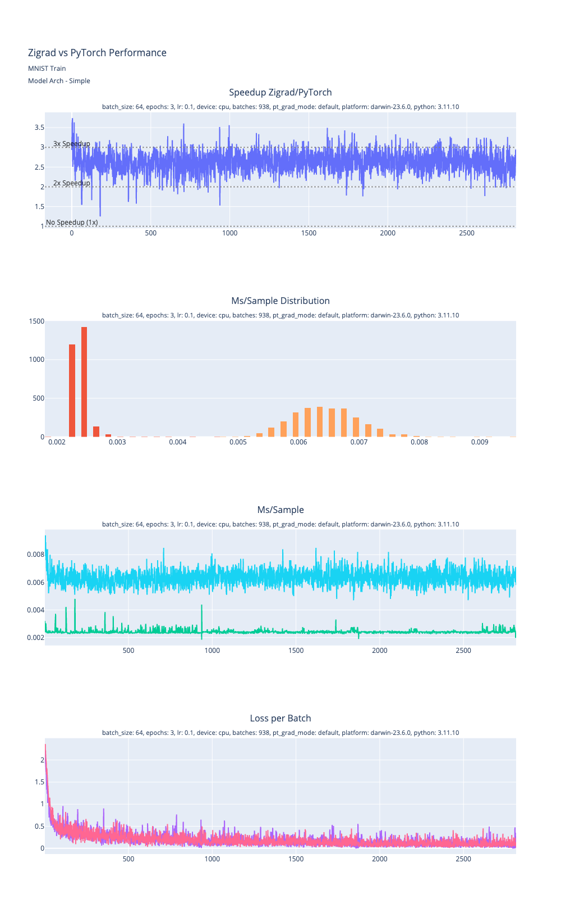

  

	
	
	
	
	<!--  -->

 

# Zigrad
#### A deep learning framework built on an autograd engine with high level abstractions and low level control.

<!-- this space is for pitching Zigrad, the most impressive talking points -->

**Fast**
<!-- benchmarks -->
<!-- TODO: some text here saying its faster than torch and linking to a benchmarking page -->

<!-- More robust benchmarking is coming via a fully heremetic reproducible benchmarking process built on Bazel. -->
<!-- only need one of these plots, probably fast vs fast since that requires the least explanation -->

2.5-4x speedup over a compiled PyTorch model on Apple Silicon on early benchmarks. Expect similar performance gains across more architectures and platforms as MKL/CUDA support improves and Zigrad's ML graph compiler is operational.

*A hermetic, reproducible benchmarking pipeline built on Bazel will allow testing across more platforms (in progress).

**Built for specialized optimization**

Zigrad's design enables deep control and customization

- Fine-grained control over memory management
- Flexible tradeoffs between performance characteristics like latency vs throughput
- Optimize for your specific hardware, use case, and system requirements
- No abstraction layers or build systems that make aggressive optimizations challenging or complex

But wait, there's more..

- Tiny binaries: binaries for the MNIST tests shown are under 400kb in `ReleaseFast` mode and under 200kb in `ReleaseSmall`.
- Graph tracing
- Tensorboard integration*
- MKL Support
- Minimal and transparent heap allocations
<!-- Scalar API -->

*Not yet merged

## Features

### Trace the Computation Graph

  

  <object type="image/svg+xml" data="./docs/comp_graph_mnist_simple_noag.svg" style="max-height: 50%"></object>

An example of tracing the computation graph generated by a fully connected neural network for MNIST.

- *Input:* Batch of images 28x28 pixel samples.
- **Flatten:** `28x28 -> 784`
- **FC1**: Linear layer `784 -> 128`
- **ReLU**
- **FC2:** Linear layer `128 -> 64`
- **ReLU**
- **FC3:** Linear layer `64 -> 10`
- *Output:* Value for each of the 10 classes

We did not have to use Zigrad's modules to write this network at all, as Zigrad is backed by a capable autograd engine. Even when using the autograd backend to dynamically construct the same neural network Zigrad can still trace the graph and render it.

  > Note: Since the graph is generated from the autograd information, we set the labels for the nodes by naming the tensors for the sake of the diagram.

  

  

  <object type="image/svg+xml" data="./docs/comp_graph_mnist_simple_ag.svg" style=""></object>

## Roadmap

A lot is planned and hoping for support from the Zig community so we can accomplish some of the more ambitious goals.

- More comprehensive MKL support
- More parallelization (e.g. activation functions)
- CUDA support
- Lazy tensors
- Static graph optimization
- Dynamic graph compiler
- MLIR
- Support for popular formats like ONNX and ggml.

## Known Issues
