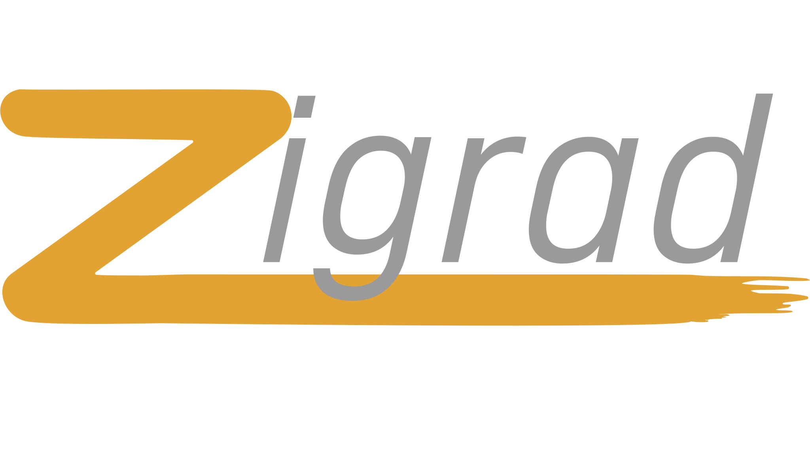

<p align="center">
  
</p>

<p align="center">
 
 
 
 
</p>
<br>
<p align="center"><strong><i>Supporting AI innovation from ideation to results.</i></strong></p>

---

> **Zigrad is under active development.**
> This is the `modular` rewrite - a ground-up redesign as a compiler-oriented ML framework. APIs and architecture are evolving rapidly.

---

Zigrad is a deep learning and ML compiler framework. Rather than tying you to a single runtime, Zigrad lowers your program to [MLIR](https://mlir.llvm.org/) and dispatches through pluggable backends and kernel providers, giving you a clear path from high-level model definition to hardware-optimized execution.

<p align="center">
  
</p>

## Features

- **Forward and reverse-mode AD** - VJP and JVP support (check out the llama training demo!)
- **OpenXLA backend** - CPU/GPU/TPU/etc execution via XLA's portable runtime interface, dynamically loadable so no rebuild required to switch devices
- **IREE backend** - AOT compilation with IREE for edge deployment
- **Pluggable kernel providers** - [TVM](https://tvm.apache.org/) (MetaSchedule tuning) and [Mirage](https://github.com/mirage-project/mirage) Superoptimizer for custom kernel generation.
- **MLIR lowering** - clean MLIR lowering pipeline with dump support at every stage and strong [OpenXLA](https://openxla.org/) and [IREE](https://iree.dev/) support via [StableHLO](https://github.com/openxla/stablehlo).
<!-- - **Nix hermetic infrastructure** - hermetic devshell with LLVM, XLA, PJRT, TVM, and StableHLO pinned -->
<!-- ([StableHLO](https://github.com/openxla/stablehlo) dialect for OpenXLA backend)  -->

## Getting Started

> **Not user friendly yet**
> Actively working on a proper on-ramp for users, this is not a primary concern at the moment.
> The external integrations are expensive to build and are not yet a polished user installation path.

Nix is the standard build and execution interface. The integration-free package is the default:

```sh
nix build --impure .#zigrad
nix run --impure .#zigrad -- pr print-demo
nix flake check --impure
```

Named configurations describe runnable combinations. Each name demands its transitive build and runtime dependencies. Users do not select matching external input fragments or repeat Zig feature flags.

| Package | Included path |
|---|---|
| `zigrad` | Integration-free PR tools and tests |
| `zigrad-xla-cpu` | Current StableHLO, XLA, and PJRT CPU path |
| `zigrad-xla-cuda` | Current StableHLO, XLA, and PJRT CUDA path |
| `zigrad-iree-cpu` | Current StableHLO and IREE CPU path |
| `zigrad-tvm-cpu` | Standalone TVM CPU tuning and execution |
| `zigrad-tvm-cuda` | Standalone TVM CUDA tuning and execution |
| `zigrad-tvm-xla-cpu` | TVM specialization on the current XLA CPU path |
| `zigrad-tvm-xla-cuda` | TVM specialization on the current XLA CUDA path |
| `zigrad-mirage-xla-cuda` | Mirage specialization on the current XLA CUDA path |
| `zigrad-dev-cuda` | Every current integration used by the broad development shell |

CUDA configurations require a working NVIDIA host driver. TVM and Mirage
derive the runtime NVRTC target from the selected device. Restricting
`cudaArchitectures` in `local-build-cfg.nix` limits upstream package
compilation to the architectures used on the local system.

For example:

```sh
nix run --impure .#zigrad-xla-cpu -- demo vjp
nix run --impure .#zigrad-iree-cpu -- demo basic --backend=iree
nix run --impure .#zigrad-tvm-cpu -- tvm check-load
```

The default development shell is intentionally broad:

```sh
direnv allow
# or
nix develop --impure
```

It exports the composed external input roots and the matching `ZG_ZIG_BUILD_ARGS` for direct Zig iteration. These variables are development interfaces. The `tvm-python` shell adds TVM's Python bindings:

```sh
nix develop --impure .#tvm-python
```

Zigrad remains buildable without Nix when Zig dependencies are available:

```sh
zig build
zig build test --summary all
```

## Architecture

The pipeline has (generally) four core stages:

| Stage | Name | Ownership | Role |
|------:|------|-----------|------|
| 1 | User Program | User | Define computation with Zigrad frontend API |
| 2 | PR | Zigrad | Transformations (AD, legality, annotations) |
| 3 | IM (i.e., StableHLO) | Shared | Serialized artifact handed to the backend |
| 4 | Backend | Mixed | Compile IM -> EA, execute EA -> results |

**Backends are runtime-loadable.** PJRT plugins, for example, are loaded at startup via `PJRT_PLUGIN_PATH`. Switching from CPU to GPU requires no recompilation.

**Kernel providers are optional.** A provider (TVM, Mirage) can claim PR subgraphs and produce compiled kernel artifacts invoked at execution time. The baseline lowering path always exists and is always correct.

## Roadmap

- User-facing frontend APIs: our APIs are far too low level at the moment, this is actually intentional while the infrastructure evolves, but we plan a much simpler easier to use API shortly.
- Distributable artifacts: removing the Nix requirement for users who simply want to use the library, this is already possible but not documented

## Contributing

- [Join the Discord](https://discord.gg/JWSSfWj3Uf) and head to the dev channels
- Open an issue before starting a PR
